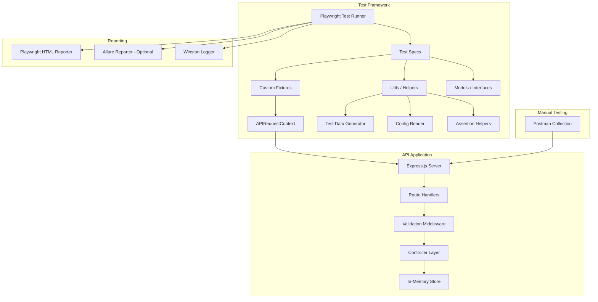
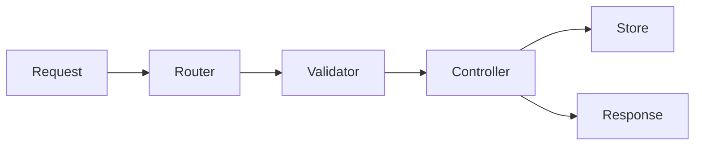
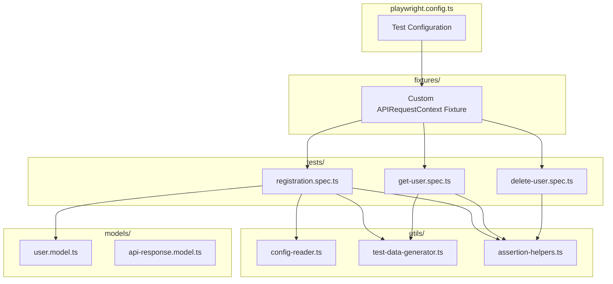

# Design Document: User Registration API Testing

## Overview

This design document describes the architecture and implementation approach for a comprehensive API Testing Framework targeting a User Registration REST API. The system consists of two main components:

1. **Registration API Application** — A Node.js/Express.js REST API with user registration endpoints (POST, GET, DELETE), in-memory data persistence, and request validation.
2. **Playwright API Testing Framework** — A TypeScript-based automation framework using `@playwright/test` and `APIRequestContext` for executing positive and negative test cases, with HTML reporting and optional Allure integration.

Supporting deliverables include a Postman Collection for manual testing, a functional test scenarios document, a detailed test cases document, and professional project documentation.

The design prioritizes testability, clear separation of concerns, and a straightforward developer experience where `npx playwright test` executes the full suite and generates reports.

## Architecture

### High-Level System Architecture



### API Application Architecture

The API follows a layered architecture pattern:



- **Router**: Maps HTTP methods and paths to handlers (`/api/users/register`, `/api/users/:id`)
- **Validator**: express-validator middleware that enforces field constraints and returns 400/409 errors
- **Controller**: Business logic for create, read, and delete operations
- **Store**: In-memory JavaScript `Map<number, User>` with auto-incrementing numeric IDs

### Test Framework Architecture

The test framework uses Playwright's built-in API testing capabilities with custom fixtures:



## Components and Interfaces

### API Application Components

#### 1. Express Server (`src/app.ts`)

Entry point that configures Express middleware (JSON body parser, CORS) and mounts route handlers.

```typescript
// Key responsibilities:
// - Initialize Express app with JSON middleware
// - Mount user routes at /api/users
// - Start server on configurable port (default 3000)
```

#### 2. User Routes (`src/routes/user.routes.ts`)

Defines the three endpoints with validation middleware chains:

| Method | Path | Middleware | Controller |
|--------|------|-----------|------------|
| POST | `/api/users/register` | `registerValidation` | `createUser` |
| GET | `/api/users/:id` | `idValidation` | `getUser` |
| DELETE | `/api/users/:id` | `idValidation` | `deleteUser` |

#### 3. Validation Middleware (`src/middleware/validation.ts`)

Uses `express-validator` to define validation chains:

- **registerValidation**: Validates all User_Model fields per Requirement 2 rules
- **idValidation**: Validates that `:id` param is a positive integer
- **handleValidationErrors**: Collects all validation errors and returns them in a single 400 response

#### 4. User Controller (`src/controllers/user.controller.ts`)

Business logic functions:

- `createUser`: Validates uniqueness of email (case-insensitive), assigns ID, persists to store, returns 201
- `getUser`: Looks up user by ID, returns 200 or 404
- `deleteUser`: Removes user by ID, returns 200 or 404

#### 5. In-Memory Store (`src/store/user.store.ts`)

```typescript
// Singleton store with Map<number, User>
// Auto-incrementing ID counter
// Methods: add(user), getById(id), deleteById(id), existsByEmail(email)
```

### Test Framework Components

#### 1. Custom Fixture (`fixtures/api-fixture.ts`)

Extends Playwright's base test with a pre-configured `APIRequestContext`:

```typescript
// Creates APIRequestContext with:
// - baseURL from config
// - Default headers: { 'Content-Type': 'application/json' }
// - Request/response interceptor for Winston logging
```

#### 2. Test Specs (`tests/`)

- `registration.spec.ts` — POST endpoint positive and negative cases
- `get-user.spec.ts` — GET endpoint positive and negative cases
- `delete-user.spec.ts` — DELETE endpoint positive and negative cases

#### 3. Test Data Generator (`utils/test-data-generator.ts`)

Uses `@faker-js/faker` to produce randomized valid user data:

```typescript
// generateValidUser(): UserRegistrationRequest
// generateValidUserMandatoryOnly(): UserRegistrationRequest
// generateInvalidEmail(): string
// generateShortPassword(): string
// generateInvalidPhone(): string
```

#### 4. Config Reader (`utils/config-reader.ts`)

Loads environment-specific configuration from `config/test.config.json`:

```typescript
// getBaseUrl(): string
// getTimeout(): number
// getRetries(): number
```

#### 5. Assertion Helpers (`utils/assertion-helpers.ts`)

Reusable validation functions:

```typescript
// assertStatus(response, expectedStatus): void
// assertContentType(response, 'application/json'): void
// assertResponseTime(response, maxMs): void
// assertFieldsPresent(body, fields[]): void
// assertValidationError(body, fieldName, expectedMessage): void
```

#### 6. Winston Logger (`utils/logger.ts`)

Configured to output to both console and date-stamped log file in `logs/` directory.

### Postman Collection Structure

The collection follows Postman Collection v2.1 format:

- **Collection Name**: User Registration API
- **Folders**: Registration, Get User, Delete User
- **Environment Variables**: `baseUrl`, `userId`, `userEmail`
- **Request ordering**: Create → Get → Delete (for Collection Runner)
- **Test scripts**: Status code validation, response field checks, variable chaining

## Data Models

### User Model

```typescript
interface Address {
  addressLine1: string;   // max 100 chars
  addressLine2?: string;  // max 100 chars, optional
  city: string;           // max 50 chars
  state: string;          // max 50 chars
  country: string;        // max 50 chars
}

interface User {
  id: number;                    // system-generated, auto-increment
  firstName: string;             // required, max 50 chars
  lastName: string;              // required, max 50 chars
  email: string;                 // required, max 100 chars, unique (case-insensitive)
  phoneNumber: string;           // required, exactly 10 digits
  password: string;              // required, 8-128 chars
  dateOfBirth?: string;          // ISO 8601 date format
  age: number;                   // required, 18-150
  gender?: string;               // optional
  nationality?: string;          // max 50 chars, optional
  employeeId?: string;           // max 20 chars, optional
  isActive?: boolean;            // optional
  address: Address;              // required
  skills?: string[];             // max 20 items, optional
}

interface UserRegistrationRequest extends Omit<User, 'id'> {
  confirmPassword: string;       // must match password
}
```

### API Response Models

```typescript
interface SuccessResponse<T> {
  status: 'success';
  data: T;
  message?: string;
}

interface ErrorResponse {
  status: 'error';
  errors: ValidationError[];
  message: string;
}

interface ValidationError {
  field: string;
  message: string;
}
```

### Validation Rules Summary

| Field | Rule | Error Status |
|-------|------|-------------|
| firstName | Required, non-empty, max 50 chars | 400 |
| lastName | Required, non-empty, max 50 chars | 400 |
| email | Required, valid format, unique (case-insensitive) | 400 / 409 |
| phoneNumber | Required, exactly 10 digits | 400 |
| password | Required, 8-128 chars | 400 |
| confirmPassword | Must match password | 400 |
| age | Required, integer 18-150 | 400 |
| address | Required, object with required sub-fields | 400 |
| User ID (path) | Must be positive integer | 400 |


## Correctness Properties

*A property is a characteristic or behavior that should hold true across all valid executions of a system — essentially, a formal statement about what the system should do. Properties serve as the bridge between human-readable specifications and machine-verifiable correctness guarantees.*

### Property 1: Registration Round-Trip

*For any* valid user registration request (with all mandatory fields satisfying validation rules), POSTing to `/api/users/register` and then GETting `/api/users/{id}` with the returned ID SHALL produce a response containing all originally submitted field values.

**Validates: Requirements 1.4, 1.5**

### Property 2: DELETE Removes User

*For any* successfully created user, sending a DELETE request for that user's ID and then sending a GET request for the same ID SHALL result in the GET returning HTTP 404.

**Validates: Requirements 1.6**

### Property 3: Required String Fields Reject Whitespace

*For any* required string field (firstName, lastName, email) and *for any* string value composed entirely of whitespace characters (including empty string), submitting a registration request with that field set to such a value SHALL return HTTP 400 with a validation error identifying the field.

**Validates: Requirements 2.1, 2.2, 2.3**

### Property 4: Invalid Email Format Rejected

*For any* string that does not contain exactly one `@` symbol followed by a domain with at least one dot, submitting it as the email field SHALL return HTTP 400 with an email format validation error.

**Validates: Requirements 2.4**

### Property 5: Duplicate Email Rejected Case-Insensitively

*For any* valid user registration that succeeds, a subsequent registration request with the same email address in any case variation (upper, lower, mixed) SHALL return HTTP 409 with a duplicate email error.

**Validates: Requirements 2.5**

### Property 6: Password Mismatch Rejected

*For any* two distinct strings used as password and confirmPassword where the strings are not identical, the registration request SHALL return HTTP 400 with a password mismatch error.

**Validates: Requirements 2.6**

### Property 7: Invalid Phone Number Rejected

*For any* string that is not exactly 10 numeric digits (0-9), submitting it as the phoneNumber field SHALL return HTTP 400 with a phone number validation error.

**Validates: Requirements 2.7**

### Property 8: Age Out of Range Rejected

*For any* integer value less than 18 or greater than 150, submitting it as the age field SHALL return HTTP 400 with an age validation error.

**Validates: Requirements 2.8**

### Property 9: Invalid Password Length Rejected

*For any* string with length less than 8 or greater than 128 characters, submitting it as the password field SHALL return HTTP 400 with a password length validation error.

**Validates: Requirements 2.14**

### Property 10: Non-Existing Numeric ID Returns 404

*For any* positive integer ID that does not correspond to a user in the In_Memory_Store, both GET `/api/users/{id}` and DELETE `/api/users/{id}` SHALL return HTTP 404 with a user-not-found error message.

**Validates: Requirements 1.10, 1.11, 2.10, 2.12**

### Property 11: Non-Numeric ID Returns 400

*For any* string value that is not a valid positive integer (including letters, special characters, decimals, negative numbers), both GET `/api/users/{id}` and DELETE `/api/users/{id}` SHALL return HTTP 400 with an invalid ID format error.

**Validates: Requirements 2.11, 2.13**

### Property 12: Multiple Validation Errors Returned Together

*For any* registration request containing N fields that each independently violate a validation rule (where N ≥ 2), the API SHALL return HTTP 400 with a response body containing at least N distinct validation error messages, one per invalid field.

**Validates: Requirements 2.15**

## Error Handling

### API Application Error Handling

| Scenario | HTTP Status | Response Format |
|----------|-------------|-----------------|
| Validation failure (one or more fields) | 400 | `{ status: "error", message: "Validation failed", errors: [{ field, message }] }` |
| Duplicate email | 409 | `{ status: "error", message: "Email already exists", errors: [{ field: "email", message: "..." }] }` |
| User not found (GET/DELETE) | 404 | `{ status: "error", message: "User not found" }` |
| Invalid ID format | 400 | `{ status: "error", message: "Invalid ID format", errors: [{ field: "id", message: "..." }] }` |
| Unhandled server error | 500 | `{ status: "error", message: "Internal server error" }` |

**Design Decisions:**

1. **All validation errors in one response**: The validation middleware collects all errors before responding (Requirement 2.15). This is implemented using `express-validator`'s `validationResult()` which aggregates all chain failures.

2. **Consistent error response structure**: All error responses follow the same `ErrorResponse` interface regardless of error type. This simplifies test assertions.

3. **Global error handler**: An Express error-handling middleware catches unhandled errors and returns 500 with a generic message, preventing stack trace leakage.

### Test Framework Error Handling

1. **Test isolation**: Each test creates its own test data via POST before exercising GET/DELETE. Tests do not depend on shared state from other tests.

2. **API server availability**: The custom fixture can include a health check before test execution. If the API is unreachable, tests fail fast with a clear message.

3. **Report generation failure**: Winston logger captures any report generation errors without stopping test execution (Requirement 9.7). The test process exit code reflects test results, not reporting status.

4. **Timeout handling**: Playwright's built-in timeout (configurable in `playwright.config.ts`) ensures tests don't hang. Default: 30 seconds per test, 2000ms assertion for response time checks.

## Testing Strategy

### Dual Testing Approach

This project uses two complementary testing strategies:

1. **Property-Based Tests (PBT)**: Validate universal properties across randomly generated inputs using `fast-check` integrated with `@playwright/test`. These verify that validation rules hold for ALL inputs in a domain, not just hand-picked examples.

2. **Example-Based Tests**: Specific scenarios from Requirements 7 and 8 that demonstrate correct behavior with concrete test data. These serve as readable documentation and regression tests.

### Property-Based Testing Configuration

- **Library**: `fast-check` (TypeScript property-based testing library)
- **Integration**: Properties tested within Playwright test specs using `fc.assert()` with `fc.asyncProperty()`
- **Iterations**: Minimum 100 runs per property
- **Tagging**: Each property test includes a comment: `// Feature: user-registration-api-testing, Property {N}: {title}`

### Test Organization

```
tests/
├── properties/
│   ├── registration-roundtrip.property.spec.ts    // Property 1
│   ├── delete-removes-user.property.spec.ts       // Property 2
│   ├── validation-required-fields.property.spec.ts // Property 3
│   ├── validation-email.property.spec.ts          // Properties 4, 5
│   ├── validation-password.property.spec.ts       // Properties 6, 9
│   ├── validation-phone-age.property.spec.ts      // Properties 7, 8
│   ├── id-validation.property.spec.ts             // Properties 10, 11
│   └── multiple-errors.property.spec.ts           // Property 12
├── positive/
│   ├── registration-positive.spec.ts              // Req 7.1, 7.2
│   ├── get-user-positive.spec.ts                  // Req 7.3, 7.5, 7.6
│   └── delete-user-positive.spec.ts              // Req 7.4
└── negative/
    ├── registration-negative.spec.ts              // Req 8.1-8.5, 8.10, 8.11
    ├── get-user-negative.spec.ts                  // Req 8.6, 8.7
    └── delete-user-negative.spec.ts              // Req 8.8, 8.9
```

### Test Execution

| Command | Purpose |
|---------|---------|
| `npx playwright test` | Run all tests (properties + examples) |
| `npx playwright test tests/properties/` | Run only property tests |
| `npx playwright test tests/positive/` | Run only positive example tests |
| `npx playwright test tests/negative/` | Run only negative example tests |
| `npx playwright show-report` | View HTML report |
| `allure serve allure-results` | View Allure report (optional) |

### Reporting

- **Primary**: Playwright HTML Reporter → `playwright-report/` directory
- **Optional**: Allure Reporter → `allure-results/` directory
- **Logging**: Winston → console + `logs/test-run-{YYYY-MM-DD}.log`

### Key Design Decisions

1. **fast-check for PBT**: Chosen over other PBT libraries because it has excellent TypeScript support, integrates cleanly with any test runner via `fc.assert()`, and supports async properties needed for HTTP calls.

2. **Separate property and example test directories**: Keeps the two testing paradigms clearly separated. Property tests run more iterations and may take longer; this separation allows running them independently.

3. **Each property maps to one test file**: Makes it easy to trace failures back to specific correctness properties in this design document.

4. **Test data generator uses faker.js**: Provides realistic randomized data for example tests. Property tests use fast-check's built-in arbitraries for more thorough input space exploration.

5. **Custom Playwright fixture with logging**: All API calls made through the fixture are automatically logged by Winston, providing full request/response audit trail without test code changes.

